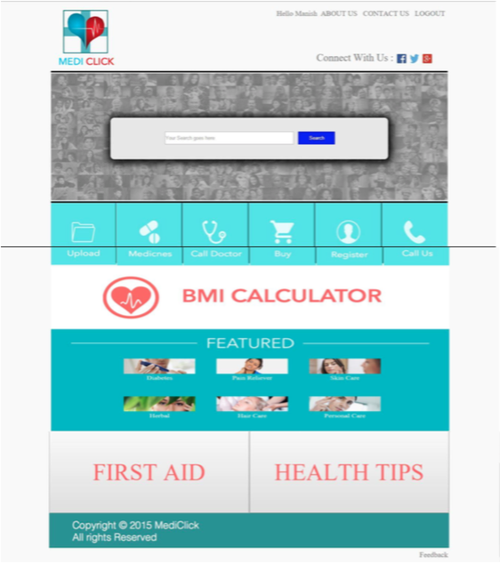
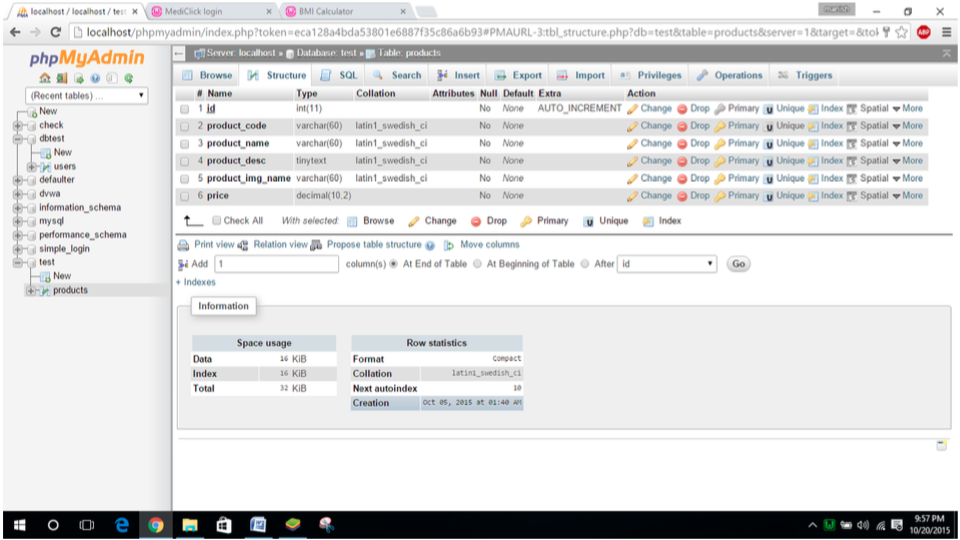
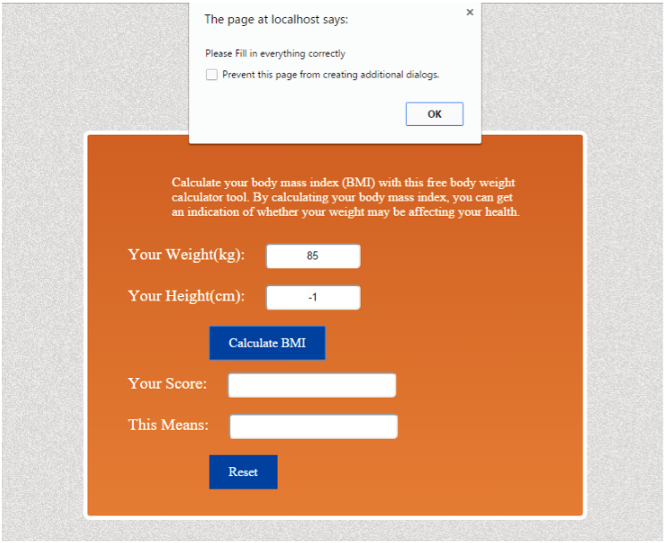

MEDICLICK

The website has the following featurs:

- Get information about the medicines
- Buy medicines
- Book appointments with doctors
- Upload prescription to order medicines
- Calculate BMI
- Get tips on health and things to include in first aid box

